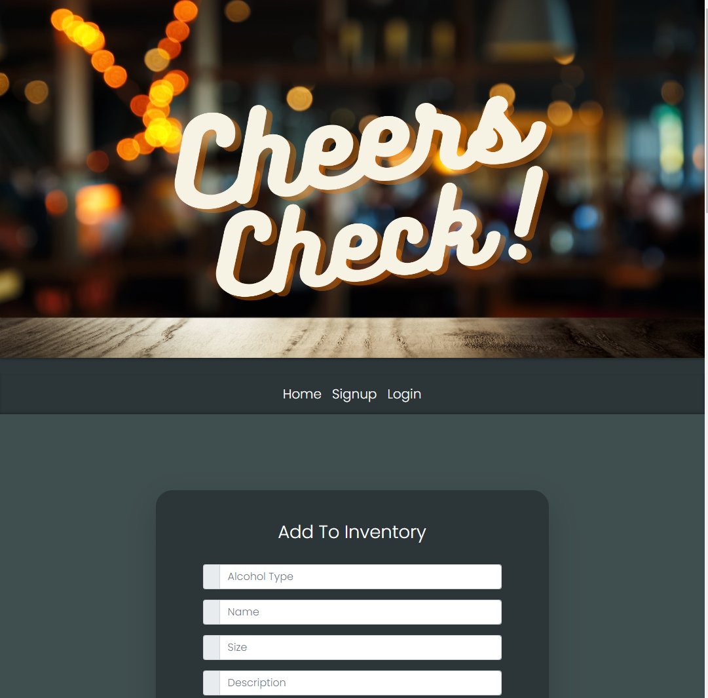

# Cheers Check 🍻

## Table of contents

- [Description](#description-📝)
- [Overview](#overview-📁)
  - [User experience](#user-experience-👤)
  - [Screenshot](#screenshot-📸)
  - [Links](#links-🔗)
- [My process](#my-process-💡)
  - [Built with](#built-with-🔨)
  - [Useful resources](#useful-resources-📚)
  - [Continued development](#continued-development-🏗️) 
- [Author](#author-✏️)
- [Acknowledgments](#acknowledgments-👏)

<br>

#  Description 📝

- A web application where alcohol enthusiasts can keep track of what's in their liquor cabinet. Users can make comments on other user's inventory as well. Using Handlebars.js as the templating language, Sequelize as the ORM, and express-session npm package for authentication.

<br>

# Overview 📁 

<br>

## User Story

```md
AS A liquor enthusiast who collects different types of alcohol
I WANT to keep track of my liquor inventory
SO THAT I can  I can share with friends and other users who might have similar tastes.
```


## User Experience 👤 

<br> 
1. Install express-handlebars package to implement Handlebars.js for your Views, use the MySQL2 and Sequelize packages to connect to a MySQL database for your Models, and create an Express.js API for your Controllers. <br>
2. You’ll also need the dotenv package to use environment variables, the bcrypt package to hash passwords, and the express-session and connect-session-sequelize packages to add authentication.

<br>


## Screenshot 📸
​<br>




###  Links 🔗

- Solution URL: [Add solution URL here](https://your-solution-url.com)
- Live Site URL: [Add live site URL here](https://your-live-site-url.com)

<br>
<hr>
<br>

##  My process 💡

###  Built with 🔨
- HTML, CSS, Bootstrap
- JavaScript
- MySQL, Sequelize
- Handlebars.js
- Node.js, Express
- Dotenv, Bycrypt
- Heroku, GitHub


<br>

###  Useful resources 📚

- Emojis:   [https://github.com/ikatyang/emoji-cheat-sheet#office](https://github.com/ikatyang/emoji-cheat-sheet#office)
- MySQL2:   [https://www.npmjs.com/package/mysql2](https://www.npmjs.com/package/mysql2)
- Sequalize:    [https://www.npmjs.com/package/sequelize](https://www.npmjs.com/package/sequelize)
- dotenv:   [https://www.npmjs.com/package/dotenv](https://www.npmjs.com/package/dotenv)

<br>
<hr>
<br>


### Continued development 🏗️

- Ability to see friends profiles and what liquors they have added
- Ability to search for new cocktails to try out and our app will suggest recipes based on the ingredients you have on hand.
- Would like to implement passport.js. Passport is authentication middleware for Node.js.A comprehensive set of strategies support authentication using a username and password, Facebook, Twitter, and more.

<br>
<hr>
<br>


## Author ✏️
Avery Caldwell: GitHub - [https://github.com/AveryCaldwell](https://github.com/AveryCaldwell)

<br>

## Acknowledgments

<br>

This is where you can give a hat tip to anyone who helped you out on this project. Perhaps you worked in a team or got some inspiration from someone else's solution. This is the perfect place to give them some credit.

